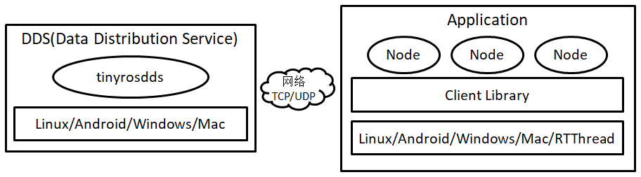

# tiny-ros
微小分布式操作系统，支持Windows、Linux、MacOS、Android、MCU RTThread或无操作系统。分布式应用的开发支持C/C++、Java、Python、Go编程语言。




## 编译安装

1、cmake 2.6 及以上

2、make 4.3 及以上

3、使用C ++ 11编译器

```
$ git clone https://github.com/tinyros/tiny-ros.git
$ cd tiny-ros && make
```

make clean清除项目，通过make重新编译安装。编译完成后目标文件生成在源代码目录下的：build/output下。更多可以查看Makefile了解。


## 支持平台

Tinyros分布式操作系统提供由C/C++、Java、Python、Go语言实现的分布式应用开发库，基于此库实现的分布式应用可以运行下列平台：

- Windows (msvc 2013+,  cygwin, Qt msvc2013+)
- Linux, FreeBSD, OpenBSD, Solaris
- macOS (clang 3.5+)
- MCU RTThread （RT-Thread v4.0.2+, LwIP 2.0.2+, C++ features）
- Android


## 特点

- 分布式操作系统和分布式应用开发库分开，开发分布式应用只需包含分布式应用开发库
- 服务与消息类型定义同“[ROS](https://www.ros.org/)”一样，并兼容“[ROS](https://www.ros.org/)”已有服务和消息类型
- 保持同“[ROS](https://www.ros.org/)”一样的编程风格：主题发布订阅提供subscribe、advertise和pulish接口；服务调用提供advertiseService、serviceClient和call接口
- tinyrosdds：数据分发服务
- tinyrostopic：提供list、echo命令行工具可以查看运行中的主题列表、查看指定主题的消息并录包
- tinyrosconsole：Tinyros日志系统，可以把打印信息显示在屏幕、指定文件或者目录中
- tinyrosservice：可以查看系统中运行的服务
- 支持TCP、UDP通信


## 例子：ExamplePublisher

#### 1、C++实现：ExamplePublisher

```c++
#include "tiny_ros/ros.h"
#include "tiny_ros/tinyros_hello/TinyrosHello.h"
int main (int argc, char *argv[]) {
  tinyros::init("ExamplePublisher", "127.0.0.1");
  tinyros::Publisher hello_pub ("tinyros_hello", new tinyros_hello::TinyrosHello());
#if 1
  tinyros::nh()->advertise(hello_pub);
#else
  tinyros::udp()->advertise(hello_pub);
#endif
  while (true) {
    tinyros_hello::TinyrosHello msg;
    msg.hello = "Hello, tiny-ros ^_^ ";
    hello_pub.publish (&msg);
#ifdef WIN32
    Sleep(1000);
#else
    sleep(1);
#endif
  }
  return 0;
}
```

#### 2、Java实现：ExamplePublisher

```java
package examples.publisher;

import com.roslib.ros.Publisher;
import com.roslib.ros.Tinyros;
import com.roslib.tinyros_hello.TinyrosHello;

public class ExamplePublisher {

    public static void main(String[] args) throws InterruptedException {
        Tinyros.init("JavaExamplePublisher", "127.0.0.1");
        
        Publisher<TinyrosHello> pub =
            new Publisher<TinyrosHello>("tinyros_hello", new TinyrosHello());
        
        Tinyros.nh().advertise(pub);
        /*Tinyros.udp().advertise(pub);*/
        
        while(true) {
            TinyrosHello msg = new TinyrosHello();
            msg.hello = "UDP: Hello, tiny-ros ^_^";
            pub.publish(msg);
            Thread.sleep(1000);
        }
    }
}
```

#### 3、Python实现：ExamplePublisher

```python
import sys
import time
import tinyros
import tinyros_hello.msg.TinyrosHello

def main():
    tinyros.init("PyExamplePublisher", "127.0.0.1")
    pub = tinyros.Publisher("tinyros_hello", tinyros_hello.msg.TinyrosHello)

    if 1:
        tinyros.nh().advertise(pub)
    else:
        tinyros.udp().advertise(pub)
    while True:
        msg = tinyros_hello.msg.TinyrosHello()
        msg.hello = 'Hello, tiny-ros ^_^ '
        pub.publish(msg)
        time.sleep(1)

if __name__ == '__main__':
    main()
```

#### 4、Go实现：ExamplePublisher

```go
package main

import (
    "time"
    "tiny_ros/tinyros"
    "tiny_ros/tinyros_hello"
)

func main() {
    tinyros.Go_init("GoExamplePublisher", "127.0.0.1")
    
    pub := tinyros.NewPublisher("tinyros_hello", tinyros_hello.NewTinyrosHello())
    
    if true {
        tinyros.Go_nh().Go_advertise(pub)
    } else {
        tinyros.Go_udp().Go_advertise(pub)
    }
    
    for {
        msg := tinyros_hello.NewTinyrosHello()
        msg.Go_hello = "Hello, tiny-ros ^_^"
        pub.Go_publish(msg)
        time.Sleep(1 * time.Second)
    }
}
```


## 例子：ExampleSubscriber

#### 1、C++实现：ExampleSubscriber

```c++
#include "tiny_ros/ros.h"
#include "tiny_ros/tinyros_hello/TinyrosHello.h"
static void subscriber_cb(const tinyros_hello::TinyrosHello& received_msg) {
  printf("%s\n", received_msg.hello.c_str());
}
int main(void) {
  tinyros::init("ExampleSubscriber", "127.0.0.1");
  tinyros::Subscriber<tinyros_hello::TinyrosHello> sub("tinyros_hello", subscriber_cb);
#if 1
  tinyros::nh()->subscribe(sub);
#else
  tinyros::udp()->subscribe(sub);
#endif
  while(true) {
#ifdef WIN32
    Sleep(10*1000);
#else
    sleep(10);
#endif
  }
  return 0;
}
```

#### 2、Java实现：ExampleSubscriber

```java
package examples.subscriber;

import com.roslib.ros.CallbackSubT;
import com.roslib.ros.Msg;
import com.roslib.ros.Subscriber;
import com.roslib.ros.Tinyros;
import com.roslib.tinyros_hello.TinyrosHello;

public class ExampleSubscriber {

    public static void main(String[] args) throws InterruptedException {
        Tinyros.init("JavaExampleSubscriber", "127.0.0.1");

        Subscriber<TinyrosHello> sub = new Subscriber<TinyrosHello>
        ("tinyros_hello", new CallbackSubT() {
            @Override
            public void callback(Msg msg) {
                TinyrosHello m = (TinyrosHello)msg;
                System.out.println(m.hello);
            }
        }, new TinyrosHello());

        Tinyros.nh().subscribe(sub);
        /*Tinyros.udp().subscribe(sub);*/

        while(true) {
            Thread.sleep(10*1000);
        }
    }
}
```

#### 3、Python实现：ExampleSubscriber

```python
import sys
import time
import tinyros
import tinyros_hello.msg.TinyrosHello

def subscriber_cb(received_msg):
    print('%s' % received_msg.hello)

def main():
    tinyros.init("PyExampleSubscriber", "127.0.0.1")
    if 1:
        tinyros.nh().subscribe(tinyros.Subscriber("tinyros_hello", subscriber_cb, tinyros_hello.msg.TinyrosHello))
    else:
        tinyros.udp().subscribe(tinyros.Subscriber("tinyros_hello", subscriber_cb, tinyros_hello.msg.TinyrosHello))
    while True:
       time.sleep(10)

if __name__ == '__main__':
    main()
```

#### 4、Go实现：ExampleSubscriber

```go
package main

import (
    "fmt"
    "time"
    "tiny_ros/tinyros"
    "tiny_ros/tinyros_hello"
)

func subscriber_cb(msg tinyros.Msg) {
    tmsg := msg.(*tinyros_hello.TinyrosHello)
    fmt.Println(tmsg.Go_hello)
}

func main() {
    tinyros.Go_init("GoExampleSubscriber", "127.0.0.1")

    sub := tinyros.NewSubscriber("tinyros_hello", subscriber_cb, tinyros_hello.NewTinyrosHello())

    if true {
        tinyros.Go_nh().Go_subscribe(sub)
    } else {
        tinyros.Go_udp().Go_subscribe(sub)
    }
    
    for {
        time.Sleep(10 * time.Second)
    }
}
```


## 例子：ExampleService

#### 1、C++实现：ExampleService

```c++
#include "tiny_ros/ros.h"
#include "tiny_ros/tinyros_hello/Test.h"
static void service_cb(const tinyros_hello::Test::Request & req, tinyros_hello::Test::Response & res) {
  res.output = "Hello, tiny-ros ^_^";
}
int main() {
  tinyros::init("ExampleService", "127.0.0.1");
  tinyros::ServiceServer<tinyros_hello::Test::Request, 
    tinyros_hello::Test::Response> server("test_srv", &service_cb);
  tinyros::nh()->advertiseService(server);
  while(true) {
#ifdef WIN32
    Sleep(10*1000);
#else
    sleep(10);
#endif
  }
  return 0;
}
```

#### 2、Java实现：ExampleService

```java
package examples.service;

import com.roslib.ros.CallbackSrvT;
import com.roslib.ros.Msg;
import com.roslib.ros.ServiceServer;
import com.roslib.ros.Tinyros;
import com.roslib.tinyros_hello.Test;

public class ExampleService {
    public static void main(String[] args) throws InterruptedException {
        Tinyros.init("JavaExampleService", "127.0.0.1");

        ServiceServer<Test.TestRequest, Test.TestResponse> srv = new ServiceServer<Test.TestRequest, Test.TestResponse>
        ("test_srv", new CallbackSrvT() {
            @Override
            public void callback(Msg req, Msg res) {
                ((Test.TestResponse)res).output = "Hello, tiny-ros ^_^";
            }
        }, new Test.TestRequest(), new Test.TestResponse());

        Tinyros.nh().advertiseService(srv);

        while(true) {
            Thread.sleep(10*1000);
        }
    }
}
```

#### 3、Python实现：ExampleService

```python
import sys
import time
import tinyros
import tinyros_hello.srv.Test

def service_cb(req, res):
    res.output = "Hello, tiny-ros ^_^"

def main():
    tinyros.init("PyExampleService", "127.0.0.1")
    tinyros.nh().advertiseService(tinyros.ServiceServer("test_srv", service_cb, \
            tinyros_hello.srv.Test.Request, tinyros_hello.srv.Test.Response))
    while True:
       time.sleep(10)

if __name__ == '__main__':
    main()
```

#### 4、Go实现：ExampleService

```go
package main

import (
    "time"
    "tiny_ros/tinyros"
    "tiny_ros/tinyros_hello"
)

func service_cb(req tinyros.Msg, resp tinyros.Msg) {
    tresp := resp.(*tinyros_hello.TestResponse)
    tresp.Go_output = "Hello, tiny-ros ^_^"
}

func main() {
    tinyros.Go_init("GoExampleService", "127.0.0.1")
    
    server := tinyros.NewServiceServer("test_srv", service_cb, tinyros_hello.NewTestRequest(), tinyros_hello.NewTestResponse())

    tinyros.Go_nh().Go_advertiseService(server)
    
    for {
        time.Sleep(10 * time.Second)
    }
}
```


## 例子：ExampleServiceClient

#### 1、C++实现：ExampleServiceClient

```c++
#include "tiny_ros/ros.h"
#include "tiny_ros/tinyros_hello/Test.h"
int main() {
  tinyros::init("ExampleServiceClient", "127.0.0.1");
  tinyros::ServiceClient<tinyros_hello::Test::Request, tinyros_hello::Test::Response> client("test_srv");
  tinyros::nh()->serviceClient(client);
  while (true) {
    tinyros_hello::Test::Request req;
    tinyros_hello::Test::Response res;
    req.input = "hello world!";
    if (client.call(req, res)) {
       printf("Service responsed with \"%s\"\n", res.output.c_str());
    } else {
       printf("Service call failed.\n");
    }
#ifdef WIN32
    Sleep(1000);
#else
    sleep(1);
#endif
  }
  return 0;
}
```

#### 2、Java实现：ExampleServiceClient

```java
package examples.service_client;

import com.roslib.ros.ServiceClient;
import com.roslib.ros.Tinyros;
import com.roslib.tinyros_hello.Test;

public class ExampleServiceClient {

    public static void main(String[] args) throws InterruptedException {
        Tinyros.init("JavaExampleServiceClient", "127.0.0.1");

        ServiceClient<Test.TestRequest, Test.TestResponse> client =
                new ServiceClient<Test.TestRequest, Test.TestResponse>(
                        "test_srv", new Test.TestRequest(), new Test.TestResponse());

        Tinyros.nh().serviceClient(client);

        while(true) {
            Test.TestRequest req = new Test.TestRequest();
            Test.TestResponse resp = new Test.TestResponse();
            if (client.call(req, resp, 3)) {
                System.out.println("service responsed with \"" + resp.output + "\"");
            } else {
                System.out.println("Service call failed.");
            }
            Thread.sleep(1000);
        }
    }
}
```

#### 3、Python实现：ExampleServiceClient

```python
import sys
import time
import tinyros
import tinyros_hello.srv.Test

def main():
    tinyros.init("PyExampleServiceClient", "127.0.0.1")
    client = tinyros.ServiceClient("test_srv", tinyros_hello.srv.Test.Request, tinyros_hello.srv.Test.Response)
    tinyros.nh().serviceClient(client)
    while True:
        req = tinyros_hello.srv.Test.Request()
        res = tinyros_hello.srv.Test.Response()
        req.input = "hello world!"
        if client.call(req, res):
            print('Service responsed with "%s"' % res.output)
        else:
            print("Service call failed.")
        time.sleep(1)

if __name__ == '__main__':
    main()
```

#### 4、Go实现：ExampleServiceClient

```go
package main

import (
    "fmt"
    "time"
    "tiny_ros/tinyros"
    "tiny_ros/tinyros_hello"
)

func main() {
    tinyros.Go_init("GoExampleServiceClient", "127.0.0.1")
    
    client := tinyros.NewServiceClient("test_srv", tinyros_hello.NewTestRequest(), tinyros_hello.NewTestResponse())

    tinyros.Go_nh().Go_serviceClient(client)

    for {
        req := tinyros_hello.NewTestRequest()
        resp := tinyros_hello.NewTestResponse()
        req.Go_input = "hello world!"
        if client.Go_call(req, resp) {
            fmt.Println("Service responsed with\"", resp.Go_output, "\"")
        } else {
            fmt.Println("Service call failed.")
        }
        time.Sleep(time.Second)
    }
}
```


## 例子：MCU RTThread （LwIP 1.4.1+）

#### 1、tinyros_entries.h

```c++
#ifndef _TINYROS_ENTRIES_H_
#define _TINYROS_ENTRIES_H_
#include <stdint.h>
#include <stdlib.h>
#ifdef __cplusplus
extern "C" {
#endif
void tinyros_example_publisher(void* parameter);
void tinyros_example_subscriber(void* parameter);
void tinyros_example_service(void* parameter);
void tinyros_example_service_client(void* parameter);
#ifdef __cplusplus
}
#endif
#endif
```


#### 2、tinyros_entries.cpp

```c++
#include "tinyros_entries.h"
#include "tiny_ros/ros.h"
#include "tiny_ros/tinyros_hello/Test.h"
#include "tiny_ros/tinyros_hello/TinyrosHello.h"

//////////////////////////////////////////////////////////
void tinyros_example_publisher(void* parameter) {
  tinyros::init("RT-Thread", "192.168.8.1");
  tinyros::Publisher hello_pub ("tinyros_hello", new tinyros_hello::TinyrosHello());
#if 1
  tinyros::nh()->advertise(hello_pub);
#else
  tinyros::udp()->advertise(hello_pub);
#endif
  while (true) {
    tinyros_hello::TinyrosHello msg;
    msg.hello = "Hello, tiny-ros ^_^ ";
    hello_pub.publish (&msg);
    rt_thread_delay(1000);
  }
}

//////////////////////////////////////////////////////////
static void subscriber_cb(const tinyros_hello::TinyrosHello& received_msg) {
  rt_kprintf("%s\n", received_msg.hello.c_str());
}
extern "C" void tinyros_example_subscriber(void* parameter) {
  tinyros::init("RT-Thread", "192.168.8.1");
  tinyros::Subscriber<tinyros_hello::TinyrosHello> sub("tinyros_hello", subscriber_cb);
#if 1
  tinyros::nh()->subscribe(sub);
#else
  tinyros::udp()->subscribe(sub);
#endif
  while(true) {
    rt_thread_delay(10*1000);
  }
}

//////////////////////////////////////////////////////////
static void service_cb(const tinyros_hello::Test::Request & req, tinyros_hello::Test::Response & res) {
  res.output = "Hello, tiny-ros ^_^";
}
void tinyros_example_service(void* parameter) {
  tinyros::init("RT-Thread", "192.168.8.1");
  tinyros::ServiceServer<tinyros_hello::Test::Request, tinyros_hello::Test::Response> server("test_srv", &service_cb);
  tinyros::nh()->advertiseService(server);
  while(true) {
    rt_thread_delay(10*1000);
  }
}

//////////////////////////////////////////////////////////
extern "C" void tinyros_example_service_client(void* parameter) {
  tinyros::init("RT-Thread", "192.168.8.1");
  tinyros::ServiceClient<tinyros_hello::Test::Request, tinyros_hello::Test::Response> client("test_srv");
  tinyros::nh()->serviceClient(client);
  while (true) {
    tinyros_hello::Test::Request req;
    tinyros_hello::Test::Response res;
    req.input = "hello world!";
    if (client.call(req, res)) {
      rt_kprintf("Service responsed with \"%s\"\n", res.output.c_str());
    } else {
      rt_kprintf("Service call failed.\n");
    }
    rt_thread_delay(1000);
  }
}
//////////////////////////////////////////////////////////
```


#### 3、main.c

```c
#include <rtthread.h>
#include <lwip/sys.h>
#include <lwip/api.h>
#include <netif/ethernetif.h>
#include "tinyros_entries.h"

extern void lwip_sys_init(void);

int main(void) {
  rt_thread_t publisher_thread_ = RT_NULL;
  rt_thread_t subscriber_thread_ = RT_NULL;
  rt_thread_t service_thread_ = RT_NULL;
  rt_thread_t service_client_thread_ = RT_NULL;

  //{ init lwip
  eth_system_device_init();
  rt_device_init_all();
  lwip_sys_init();
  // }

  // {tinyros_example_publisher
  publisher_thread_ = rt_thread_create("pub", tinyros_example_publisher, RT_NULL, 1024, 5, 20);
  rt_thread_startup(publisher_thread_);
  // }

  // {tinyros_example_subscriber
  subscriber_thread_ = rt_thread_create("sub", tinyros_example_subscriber, RT_NULL, 1024, 5, 20);
  rt_thread_startup(subscriber_thread_);
  // }

  // {tinyros_example_service
  service_thread_ = rt_thread_create("svc", tinyros_example_service, RT_NULL, 1024, 5, 20);
  rt_thread_startup(service_thread_);
  // }

  // {tinyros_example_service_client
  service_client_thread_ = rt_thread_create("svcclient", tinyros_example_service_client, RT_NULL, 1024, 5, 20);
  rt_thread_startup(service_client_thread_);
  // }
  return 0;
}
```

