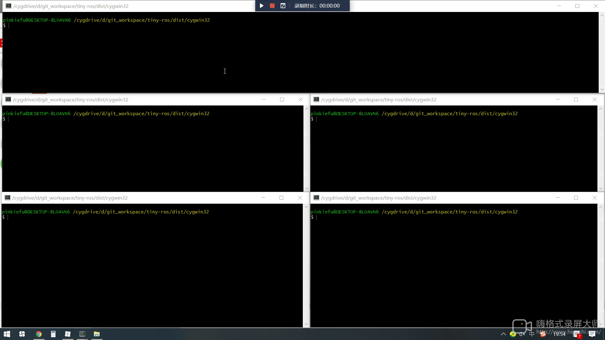

## tiny-ros
微小分布式操作系统，支持Windows、RTThread、Windows、Ubuntu、MacOS或无操作系统。支持编程语言C/C++、Java




## 编译安装

1、cmake 2.6 及以上

2、make 4.3 及以上

2、使用C ++ 11编译器

```
$ git clone https://github.com/tinyros/tiny-ros.git
$ cd tiny-ros && make
```

make clean清除项目，通过make重新编译安装。编译完成后目标文件生成在源代码目录下的：build/output下。更多可以查看Makefile了解。


## 支持平台

Tinyros分布式操作系统由tinyroscore实现，提供独立于分布式操作系统由Java、C++11和RTThread C/C++三种语言实现的分布式应用开发库，基于此库实现的分布式应用可以运行下列平台：

- Windows (msvc 2013+,  cygwin, Qt msvc2013+)
- Linux, FreeBSD, OpenBSD，,Solaris
- macOS (clang 3.5+)
- MCU RTThread （LwIP 1.4.1+）
- Android


## 特点

- 分布式操作系统和分布式应用开发库分开，开发分布式应用只需包含分布式应用开发库
- 服务与消息类型定义同“[ROS](https://www.ros.org/)”一样，并兼容“[ROS](https://www.ros.org/)”已有服务和消息类型
- 保持同“[ROS](https://www.ros.org/)”一样的编程风格：主题发布订阅提供subscribe、advertise和pulish接口；服务调用提供advertiseService、serviceClient和call接口
- tinyroscore：有别于“[ROS](https://www.ros.org/)”的"[roscore](http://wiki.ros.org/roscore)"，tinyroscore基于弱中心实现：
  - tinyroscore与其它设备的分布式应用节点没有启动先后顺序要求
  - tinyroscore奔溃后重启，其它设备上的分布式应用节点不用重启也能继续正常通信
- tinyrostopic：提供list、echo命令行工具可以查看运行中的主题列表、查看指定主题的消息并录包
- tinyrosconsole：Tinyros日志系统，可以把打印信息显示在屏幕、指定文件或者目录中
- tinyrosservice：可以查看系统中运行的服务
- 支持TCP、UDP通信


## 例子：ExamplePublisher

#### 1、C++实现：ExamplePublisher

```c++
#include "tiny_ros/ros.h"
#include "tiny_ros/tinyros_hello/TinyrosHello.h"
int main (int argc, char *argv[]) {
  tinyros::Publisher hello_pub ("tinyros_hello", new tinyros_hello::TinyrosHello());
#if 1
  tinyros::nh()->advertise(hello_pub);
#else
  tinyros::udp()->advertise(hello_pub);
#endif
  while (true) {
    tinyros_hello::TinyrosHello msg;
    msg.hello = "Hello, tiny-ros ^_^ ";
    hello_pub.publish (&msg);
#ifdef WIN32
    Sleep(1000);
#else
    sleep(1);
#endif
  }
  return 0;
}
```

#### 2、Java实现：ExamplePublisher

```java
package examples.publisher;

import com.roslib.ros.NodeHandle;
import com.roslib.ros.Publisher;
import com.roslib.tinyros_hello.TinyrosHello;

public class ExamplePublisher {
  public static void main(String[] args) throws InterruptedException {
    NodeHandle nh = new NodeHandle();
    while (!nh.initNode("127.0.0.1")) {
      System.out.println("Java: initNode failed.");
      Thread.sleep(500);
    }

    TinyrosHello msg = new TinyrosHello();
    Publisher<TinyrosHello> pub = new Publisher<>("tinyros_hello", msg);

    nh.advertise(pub);

    while(nh.ok()) {
      if (pub.negotiated()) {
        msg.hello = "Hello, tiny-ros ^_^";
        pub.publish(msg);
      }

      nh.spinOnce();
      Thread.sleep(500);
    }
  }
}
```


## 例子：ExampleSubscriber

#### 1、C++实现：ExampleSubscriber

```c++
#include "tiny_ros/ros.h"
#include "tiny_ros/tinyros_hello/TinyrosHello.h"
static void subscriber_cb(const tinyros_hello::TinyrosHello& received_msg) {
  printf("%s\n", received_msg.hello.c_str());
}
int main(void) {
  tinyros::Subscriber<tinyros_hello::TinyrosHello> sub("tinyros_hello", subscriber_cb);
#if 1
  tinyros::nh()->subscribe(sub);
#else
  tinyros::udp()->subscribe(sub);
#endif
  while(true) {
#ifdef WIN32
    Sleep(10*1000);
#else
    sleep(10);
#endif
  }
  return 0;
}
```

#### 2、Java实现：ExampleSubscriber

```java
package examples.subscriber;

import com.roslib.ros.CallbackSubT;
import com.roslib.ros.Msg;
import com.roslib.ros.NodeHandle;
import com.roslib.ros.Subscriber;
import com.roslib.tinyros_hello.TinyrosHello;

public class ExampleSubscriber {
  public static void main(String[] args) throws InterruptedException {
    NodeHandle nh = new NodeHandle();
    while (!nh.initNode("127.0.0.1")) {
      System.out.println("initNode failed.");
      Thread.sleep(500);
    }

    nh.subscribe(new Subscriber<TinyrosHello>("tinyros_hello", new CallbackSubT() {
      @Override
      public void callback(Msg msg) {
        TinyrosHello m = (TinyrosHello)msg;
        System.out.println(m.hello);
      }
    }, new TinyrosHello()));

    while(nh.ok()) {
      nh.spinOnce();
      Thread.sleep(500);
    }
  }
}
```


## 例子：ExampleService

#### 1、C++实现：ExampleService

```c++
#include "tiny_ros/ros.h"
#include "tiny_ros/tinyros_hello/Test.h"
static void service_cb(const tinyros_hello::Test::Request & req, tinyros_hello::Test::Response & res) {
  res.output = "Hello, tiny-ros ^_^";
}
int main() {
  tinyros::ServiceServer<tinyros_hello::Test::Request, tinyros_hello::Test::Response> server("test_srv", &service_cb);
  tinyros::nh()->advertiseService(server);
  while(true) {
#ifdef WIN32
    Sleep(10*1000);
#else
    sleep(10);
#endif
  }
  return 0;
}
```

#### 2、Java实现：ExampleService

```java
package examples.service;

import com.roslib.ros.CallbackSrvT;
import com.roslib.ros.Msg;
import com.roslib.ros.NodeHandle;
import com.roslib.ros.ServiceServer;
import com.roslib.tinyros_hello.Test;

public class ExampleService {
  public static void main(String[] args) throws InterruptedException {
    NodeHandle nh = new NodeHandle();
    while (!nh.initNode("127.0.0.1")) {
      System.out.println("Java: initNode failed.");
      Thread.sleep(500);
    }

    nh.advertiseService(new ServiceServer<Test.TestRequest,
        Test.TestResponse>("test_srv", new CallbackSrvT() {
      @Override
      public void callback(Msg req, Msg res) {
        ((Test.TestResponse) res).output = "Hello, tiny-ros ^_^";
      }
    }, new Test.TestRequest(), new Test.TestResponse()));

    while (nh.ok()) {
      nh.spinOnce();
      Thread.sleep(500);
    }
  }
}
```


## 例子：ExampleServiceClient

#### 1、C++实现：ExampleServiceClient

```c++
#include "tiny_ros/ros.h"
#include "tiny_ros/tinyros_hello/Test.h"
int main() {
  tinyros::ServiceClient<tinyros_hello::Test::Request, tinyros_hello::Test::Response> client("test_srv");
  tinyros::nh()->serviceClient(client);
  while (true) {
    tinyros_hello::Test::Request req;
    tinyros_hello::Test::Response res;
    req.input = "hello world!";
    if (client.call(req, res)) {
       printf("Service responsed with \"%s\"\n", res.output.c_str());
    } else {
       printf("Service call failed.\n");
    }
#ifdef WIN32
    Sleep(1000);
#else
    sleep(1);
#endif
  }
  return 0;
}
```

2、Java实现：ExampleServiceClient

```java
package examples.service_client;

import com.roslib.ros.NodeHandle;
import com.roslib.ros.ServiceClient;
import com.roslib.tinyros_hello.Test;

public class ExampleServiceClient {
  public static void main(String[] args) throws InterruptedException {
    NodeHandle nh = new NodeHandle();
    while (!nh.initNode("127.0.0.1")) {
      System.out.println("initNode failed.");
      Thread.sleep(500);
    }

    ServiceClient<Test.TestRequest, Test.TestResponse> client = 
        new ServiceClient<Test.TestRequest, Test.TestResponse>(
        "test_srv", new Test.TestRequest(), new Test.TestResponse());

    nh.serviceClient(client);

    new Thread(new Runnable(){
      ServiceClient<Test.TestRequest, Test.TestResponse> cl = client;
      public void run(){
        while(true) {
          Test.TestRequest req = new Test.TestRequest();
          Test.TestResponse resp = new Test.TestResponse();
          if (cl.call(req, resp, 5)) {
            System.out.println("service responsed with \"" + resp.output + "\"");
          } else {
            System.out.println("Service call failed.");
          }
        }
      }}).start();

    while(nh.ok()) {
      nh.spinOnce();
      Thread.sleep(500);
    }
  }
}
```


## 例子：MCU RTThread （LwIP 1.4.1+）

#### 1、tinyros_entries.h

```c++
#ifndef _TINYROS_ENTRIES_H_
#define _TINYROS_ENTRIES_H_
#include <stdint.h>
#include <stdlib.h>
#ifdef __cplusplus
extern "C" {
#endif
void tinyros_example_publisher(void* parameter);
void tinyros_example_subscriber(void* parameter);
void tinyros_example_service(void* parameter);
void tinyros_example_service_client(void* parameter);
#ifdef __cplusplus
}
#endif
#endif
```


#### 2、tinyros_entries.cpp

```c++
#include "tinyros_entries.h"
#include "tiny_ros/ros.h"
#include "tiny_ros/tinyros_hello/Test.h"
#include "tiny_ros/tinyros_hello/TinyrosHello.h"

//////////////////////////////////////////////////////////
void tinyros_example_publisher(void* parameter) {
  tinyros::init("192.168.8.1");
  tinyros::Publisher hello_pub ("tinyros_hello", new tinyros_hello::TinyrosHello());
#if 1
  tinyros::nh()->advertise(hello_pub);
#else
  tinyros::udp()->advertise(hello_pub);
#endif
  while (true) {
    tinyros_hello::TinyrosHello msg;
    msg.hello = "Hello, tiny-ros ^_^ ";
    hello_pub.publish (&msg);
    rt_thread_delay(1000);
  }
}

//////////////////////////////////////////////////////////
static void subscriber_cb(const tinyros_hello::TinyrosHello& received_msg) {
  rt_kprintf("%s\n", received_msg.hello.c_str());
}
extern "C" void tinyros_example_subscriber(void* parameter) {
  tinyros::init("192.168.8.1");
  tinyros::Subscriber<tinyros_hello::TinyrosHello> sub("tinyros_hello", subscriber_cb);
#if 1
  tinyros::nh()->subscribe(sub);
#else
  tinyros::udp()->subscribe(sub);
#endif
  while(true) {
    rt_thread_delay(10*1000);
  }
}

//////////////////////////////////////////////////////////
static void service_cb(const tinyros_hello::Test::Request & req, tinyros_hello::Test::Response & res) {
  res.output = "Hello, tiny-ros ^_^";
}
void tinyros_example_service(void* parameter) {
  tinyros::init("192.168.8.1");
  tinyros::ServiceServer<tinyros_hello::Test::Request, tinyros_hello::Test::Response> server("test_srv", &service_cb);
  tinyros::nh()->advertiseService(server);
  while(true) {
    rt_thread_delay(10*1000);
  }
}

//////////////////////////////////////////////////////////
extern "C" void tinyros_example_service_client(void* parameter) {
  tinyros::init("192.168.8.1");
  tinyros::ServiceClient<tinyros_hello::Test::Request, tinyros_hello::Test::Response> client("test_srv");
  tinyros::nh()->serviceClient(client);
  while (true) {
    tinyros_hello::Test::Request req;
    tinyros_hello::Test::Response res;
    req.input = "hello world!";
    if (client.call(req, res)) {
      rt_kprintf("Service responsed with \"%s\"\n", res.output.c_str());
    } else {
      rt_kprintf("Service call failed.\n");
    }
    rt_thread_delay(1000);
  }
}
//////////////////////////////////////////////////////////
```


#### 3、main.c

```c
#include <rtthread.h>
#include <lwip/sys.h>
#include <lwip/api.h>
#include <netif/ethernetif.h>
#include "tinyros_entries.h"

extern void lwip_sys_init(void);

int main(void) {
  rt_thread_t publisher_thread_ = RT_NULL;
  rt_thread_t subscriber_thread_ = RT_NULL;
  rt_thread_t service_thread_ = RT_NULL;
  rt_thread_t service_client_thread_ = RT_NULL;

  //{ init lwip
  eth_system_device_init();
  rt_device_init_all();
  lwip_sys_init();
  // }

  // {tinyros_example_publisher
  publisher_thread_ = rt_thread_create("pub", tinyros_example_publisher, RT_NULL, 1024, 5, 20);
  rt_thread_startup(publisher_thread_);
  // }

  // {tinyros_example_subscriber
  subscriber_thread_ = rt_thread_create("sub", tinyros_example_subscriber, RT_NULL, 1024, 5, 20);
  rt_thread_startup(subscriber_thread_);
  // }

  // {tinyros_example_service
  service_thread_ = rt_thread_create("svc", tinyros_example_service, RT_NULL, 1024, 5, 20);
  rt_thread_startup(service_thread_);
  // }

  // {tinyros_example_service_client
  service_client_thread_ = rt_thread_create("svcclient", tinyros_example_service_client, RT_NULL, 1024, 5, 20);
  rt_thread_startup(service_client_thread_);
  // }
  return 0;
}
```

